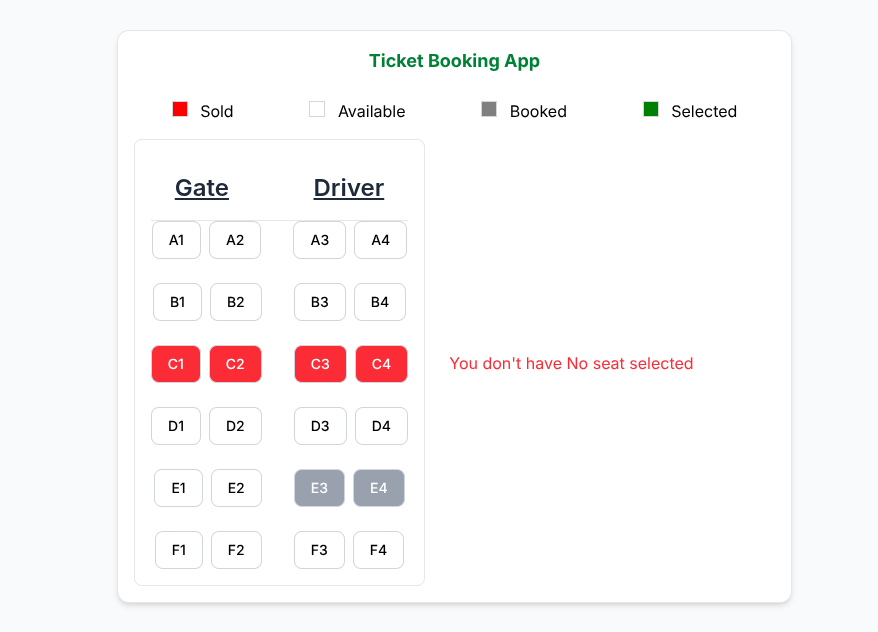
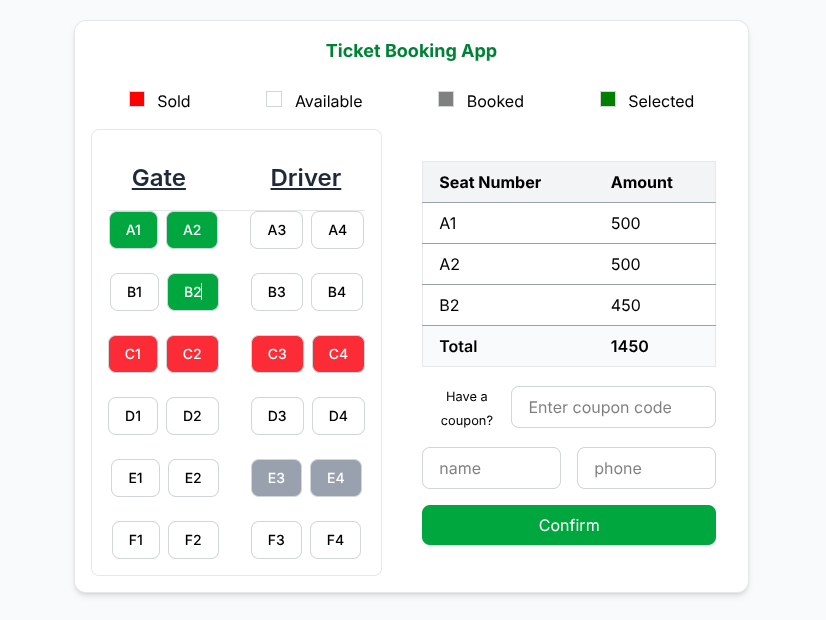
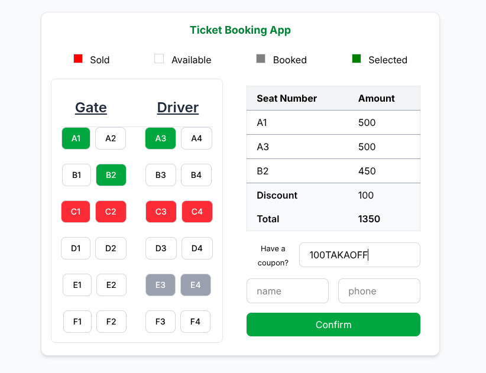
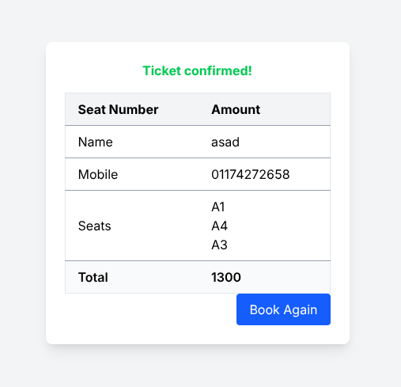
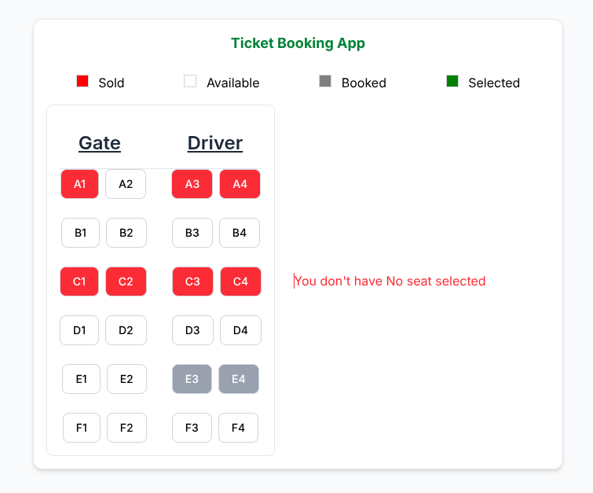

# Ticket Booking App

A simple ticket booking application built with Vue.js and Tailwind CSS.

## Screenshot

To add a screenshot:
1. Open `index.html` in your web browser.
2. Take a screenshot of the application.
3. Save the image (e.g., `screenshot.png`) in the project's root directory.







## Features

*   Select and deselect seats.
*   View total price.
*   Apply coupons.
*   Confirm booking.

## Setup

1.  Clone the repository.

```bash
    https://github.com/shamimrdev/vue-ticket-booking.git
```

2.  Open `index.html` in your browser.

## Usage

1.  Select up to 3 seats.
2.  Enter a coupon code (optional).
3.  Enter your name and mobile number.
4.  Click "Confirm" to book the tickets.

